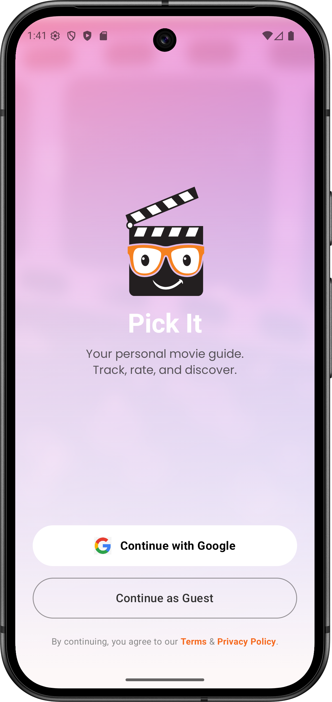
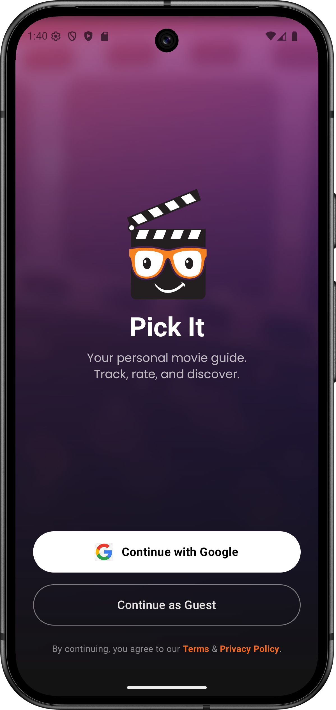
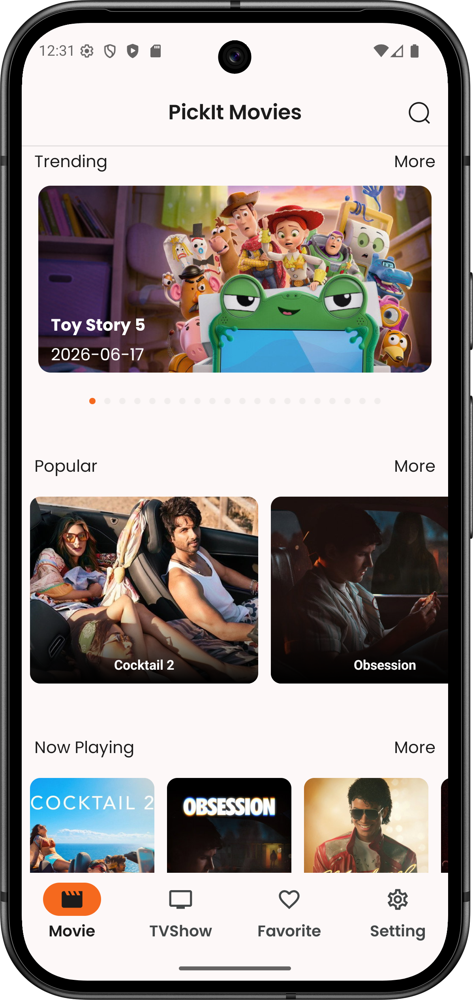
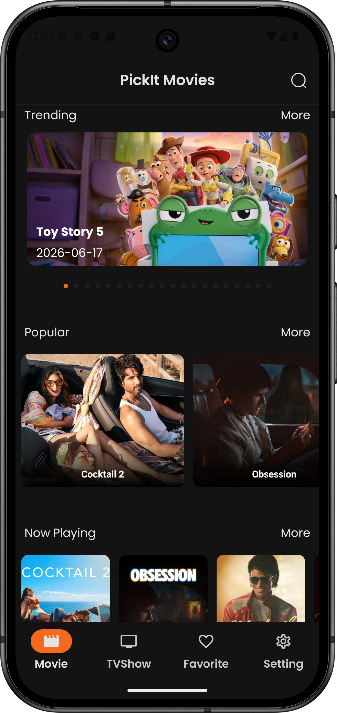
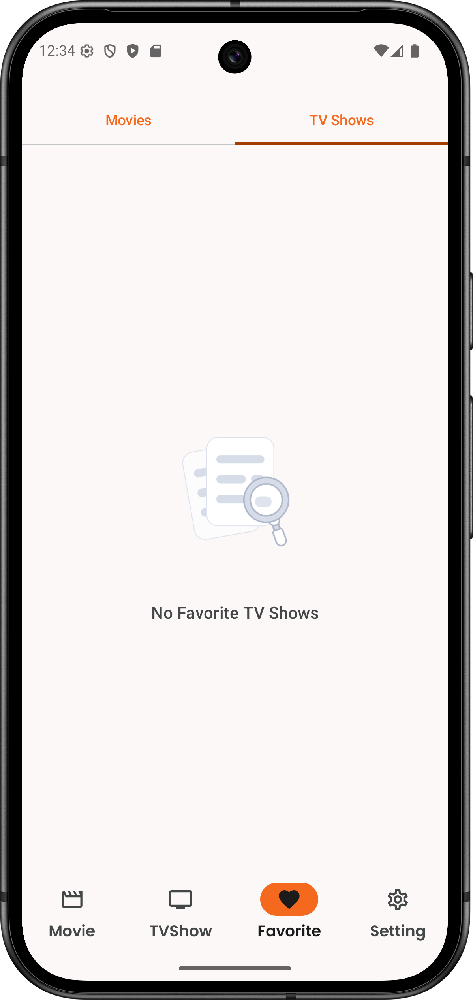
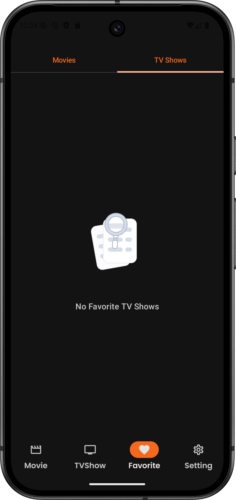
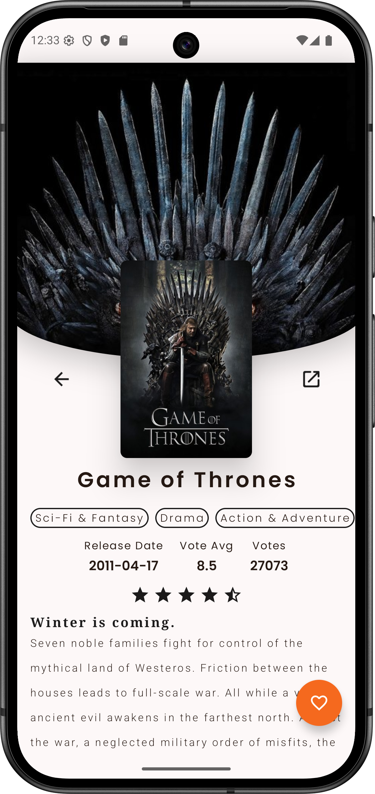
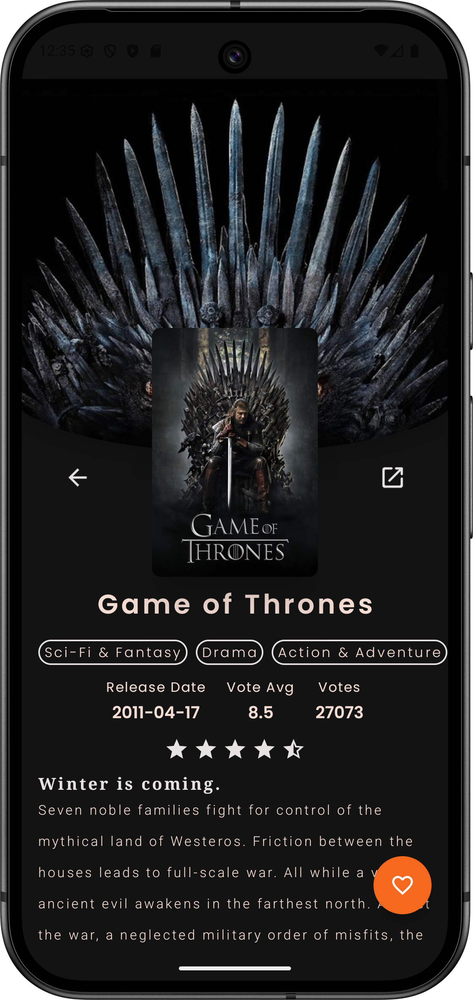
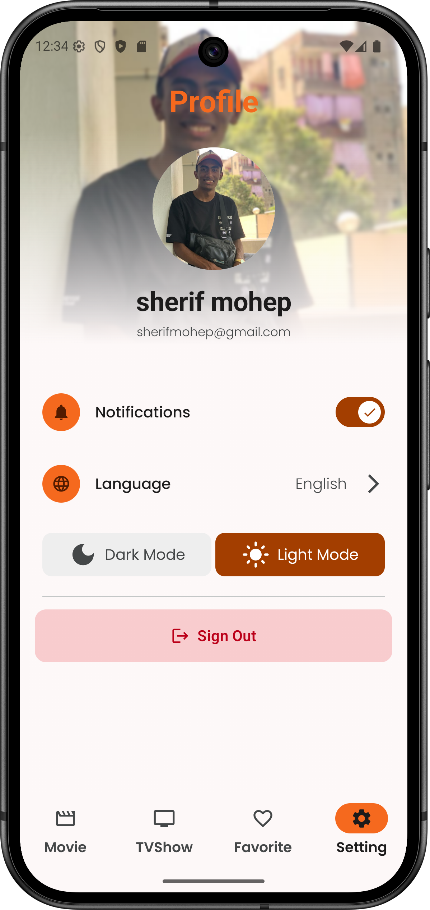
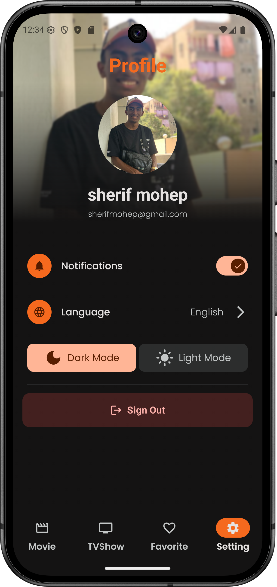

# 🎬 PickIt - Ultimate Movie & TV Show Discovery App

<div align="center">
  
  <br>
  <h3><b>PickIt</b> is a modern, cutting-edge Android application built to help users discover, search, and track their favorite Movies and TV Shows.</h3>
</div>

<br>

Built with **Kotlin** and **Jetpack Compose**, it leverages the power of **The Movie Database (TMDB) API** following the **Clean Architecture** principles and **MVVM** pattern to ensure scalability, testability, and performance.

## ✨ Features

* **🚀 Modern UI:** Fully built with **Jetpack Compose** & **Material 3** Design.
* **♾️ Infinite Browsing:** Seamless pagination using **Paging 3** for Trending, Popular, Top Rated, and more.
* **🔍 Smart Search:** Search for Movies and TV Shows with search history and filters (Genres, Languages).
* **📱 Edge-to-Edge Design:** Immersive experience with transparent status and navigation bars.
* **❤️ Favorites (Bookmarks):** Save your favorite content locally using **Room Database** (Works Offline).
* **ℹ️ Detailed Insights:** View cast, crew, trailers, similar items, and high-quality images.
* **🏎️ Performance:** Heavy use of **Coroutines** & **Flow** for asynchronous operations.
* **🎨 Dynamic Theming:** Extracts vibrant colors from movie posters to theme the details screen using **Palette API**.
* **👋 Onboarding:** A welcoming onboarding flow using **DataStore** to persist state.
---


## 📸 Screenshots
| Feature / Screen |                                   Light Mode                                    | Dark Mode |
| :--- |:-------------------------------------------------------------------------------:| :---: |
| **Onboarding & Auth** <br> First-launch experience and secure user authentication. |  |  |
| **Home & Discovery** <br> Personalized movie and TV show recommendations. |       |  |
| **Favorites (Bookmarks)** <br> Real-time user saved list synchronized with Cloud Firestore. |    |  |
| **Media Details** <br> Deep-dive views featuring cast lists, summaries, and ratings. |        |  |
| **User Profile & Settings** <br> Personal preferences, language switching, and account data. |        |  |


---


## 🛠️ Tech Stack & Libraries

* **Language:** [Kotlin](https://kotlinlang.org/) (100%)
* **UI Framework:** [Jetpack Compose](https://developer.android.com/jetpack/compose) (Material 3)
* **Architecture:** Clean Architecture (Data, Domain, Presentation) + MVVM.
* **Dependency Injection:** [Dagger Hilt](https://dagger.dev/hilt/).
* **Network:** [Retrofit](https://square.github.io/retrofit/) + [OkHttp](https://square.github.io/okhttp/).
* **Serialization:** [Kotlinx Serialization](https://github.com/Kotlin/kotlinx.serialization) (Type-safe JSON parsing).
* **Backend & Data Storage:** [Firebase](https://firebase.google.com/) (Authentication & Firestore/Realtime Database for user sync).
* **Image Loading:** [Coil](https://coil-kt.github.io/coil/).
* **Pagination:** [Paging 3](https://developer.android.com/topic/libraries/architecture/paging/v3).
* **Async:** Coroutines & StateFlow.
* **Navigation:** Navigation Compose (with Nested Graphs & Type-safe arguments).
* **Preferences:** Jetpack DataStore.
* **Browser:** Chrome Custom Tabs.
* **Animations:** Lottie Files & Compose Animation API.

--- 


## 🏗️ Architecture & Project Structure

The project is built using **Clean Architecture** principles structured inside a **package-by-feature** layout. This organizes the codebase around distinct business functionalities rather than technical layers, making the code much easier to navigate and maintain as it grows.
### The Architectural Layers:
1. **Domain Layer:** Contains pure Kotlin business logic (UseCases, Domain Models, and Repository Interfaces). It is completely isolated and has zero Android framework dependencies.
2. **Data Layer:** Handles data retrieval and persistence. Contains Retrofit API services, Room Database entities/DAOs, Data Transfer Objects (DTOs), and concrete Repository implementations that map raw data down to Domain models.
3. **Presentation Layer:** Manages UI states and user interaction using Jetpack Compose Screens and state-holding ViewModels.

### Package Topology:

```text
com.hitech.pickit
│   MainActivity.kt                 # App entry point hosting Compose NavHost
│   PickItApplication.kt            # Hilt Application class establishing dependency container
│
├── auth                            # Authentication Feature Module (Data, Domain, Presentation)
│   ├── data                        # Mappers, Firebase Auth Repository implementations
│   ├── di                          # Hilt Auth dependency injection modules
│   ├── domain                      # Auth Models & Repository interfaces
│   └── presentation                # Auth Compose UI screens & state-holding ViewModels
│
├── core                            # Shared cross-cutting components & infrastructure
│   ├── data                        # Centralized Room DB configurations & Retrofit client boilerplate
│   ├── di                          # Global Hilt modules (Network, Database, Coroutine Dispatchers)
│   ├── domain                      # Universal error handling paradigms & generic Result wrappers
│   └── presentation                # Global design system theme (Color, Type) & UI utilities
│
├── media                           # Primary Feature Module (Movies, TV Shows & Actors)
│   ├── data                        # TMDB API Endpoints, DTO response parsing, and Paging 3 Sources
│   ├── di                          # Media-scoped Hilt modules
│   ├── domain                      # Core business models & repository abstraction contracts
│   └── presentation                # Screen UI layouts, parameter-safe navigation graphs, and BaseViewModels
│
├── navigation                      # Global orchestration layer
│   └── presentation                # Persistent Bottom App Bar components & Master Navigation Graph
│
├── onboarding                      # App first-launch interactive walkthrough
│   ├── data                        # Jetpack DataStore configurations for state persistence
│   └── presentation                # Pager layout flows & introductory user screens
│
└── profile                         # User Personalization & Local Settings Engine
    ├── data                        # Preference tracking endpoints (App-wide Theme/Language state)
    ├── di                          # Settings-scoped injection graphs
    ├── domain                      # Focused single-task UseCases (GetLanguageUseCase, SetAppThemeUseCase)
    └── presentation                # Preferences configuration UI & reactive ProfileViewModels
```
---

## 🚀 Getting Started

Follow these steps to set up the project locally on your machine.

### Prerequisites

* **Android Studio** (Ladybug or newer recommended)
* **JDK 17+**
* A **TMDB (The Movie Database)** Account

---

### Setup Instructions

1. **Clone the Repository** 
   * Clone the main repository or your fork using the terminal:
   * git clone [https://github.com/Sherif-Moheep/Pick_it.git](https://github.com/Sherif-Moheep/Pick_it.git)
   * cd Pick_it
2. **Obtain a TMDB API Token** 
   * Sign up or log in at The Movie Database (TMDB).
   * Navigate to Account Settings > API from your profile menu.
   * Generate a new API key and copy the API Read Access Token (Bearer Token).


3. **Configure Secrets** `[local.properties]`
   Open or create the local.properties file in your project's root directory and add your bearer token enclosed in quotation marks:
   TMDB_BEARER_TOKEN="YOUR_TMDB_READ_ACCESS_TOKEN_HERE"
> ⚠️ Security Note: local.properties is included in .gitignore by default. Never commit your actual API token to a public repository.


4. **Build and Run** `[Android Studio]`
   * Open Android Studio and choose Open Existing Project, selecting the cloned root folder.
   * Wait for the IDE to finish indexing, then click Sync Project with Gradle Files.
   * Select an emulator or connected physical device and press Run (Shift + F10).


---

## 👥 The Team

This project was developed as a graduation capstone by:

* **Sherif Moheep** - [GitHub Profile Link](https://github.com/Sherif-Moheep)
* **Robert Romany** - [GitHub Profile Link](https://github.com/RobertRomany)
* **Mokhtar Mohamed** - [GitHub Profile Link]()
* **Hussain Mustafa** - [GitHub Profile Link](https://github.com/Hassien12)
* **Osama Mohamed** - [GitHub Profile Link](https://github.com/EngOsamaMohamed)

---
